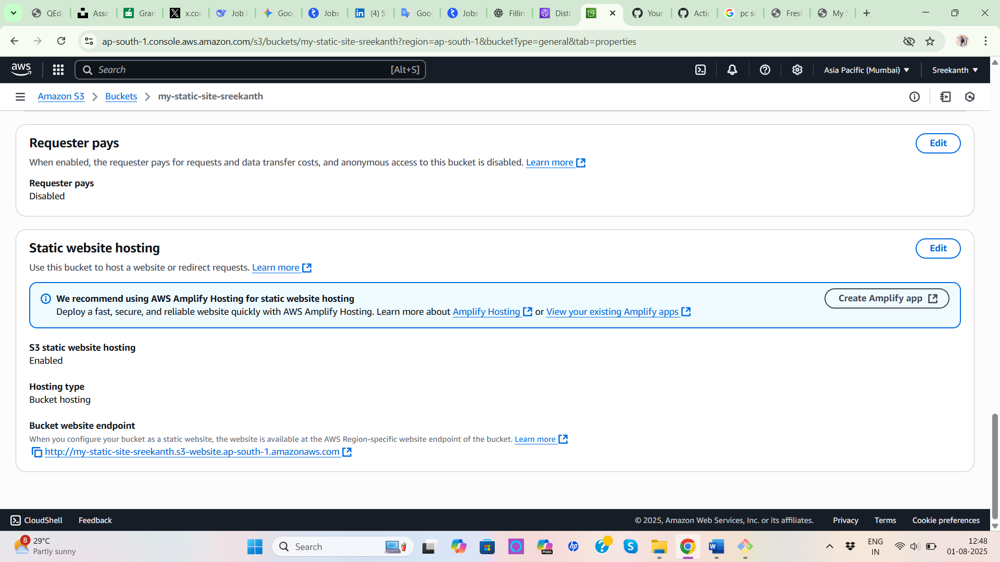
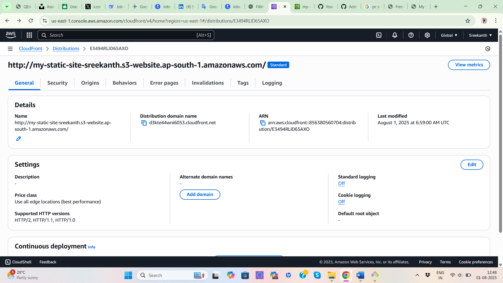
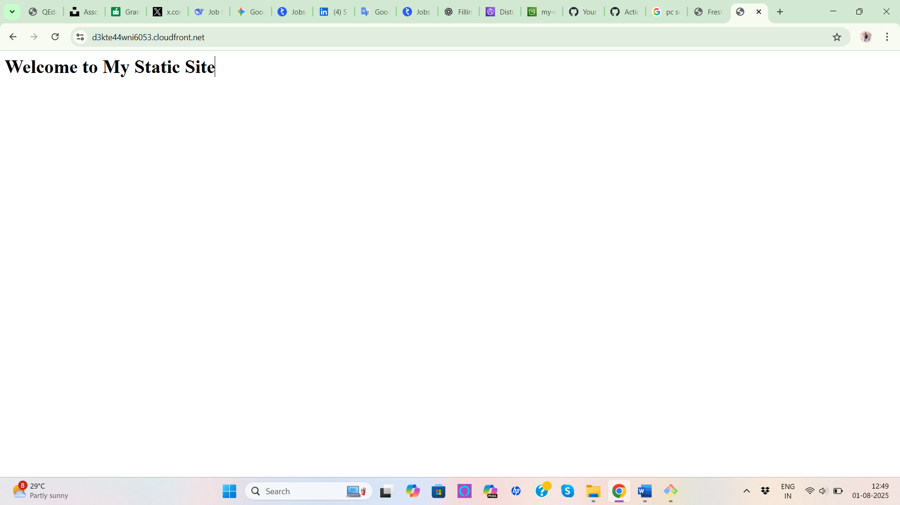

# Static Website Deployment on AWS (S3 + CloudFront)

## 📝 Project Overview
This project demonstrates how to host a static website using AWS S3 and serve it via CloudFront for global performance and security.

## 📁 Steps Followed
1. Created and configured S3 bucket for static website hosting.
2. Uploaded `index.html` and `error.html`.
3. Enabled public access (or via CloudFront origin access control).
4. Created CloudFront distribution linked to S3.
5. Tested successful deployment via the CloudFront domain.

## ✅ CloudFront Link
https://d3kte44wni6053.cloudfront.net/

## 📸 Screenshots

### ✅ S3 Static Website Hosting Enabled

### ✅ CloudFront Distribution Setup

### ✅ Live Website Preview

